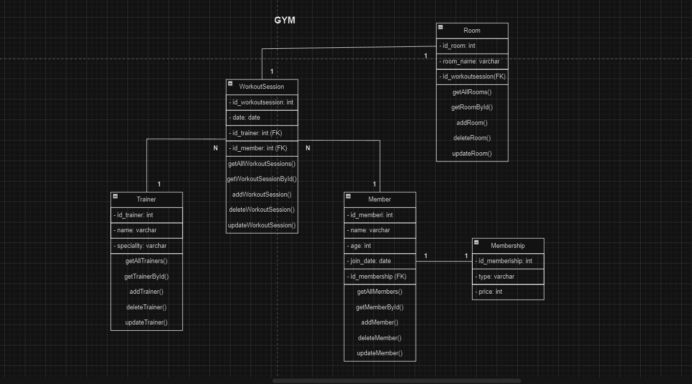
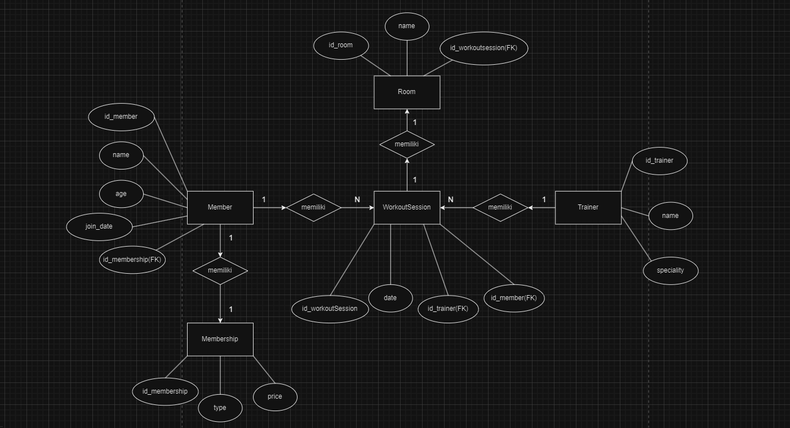

# REST API GYM MANAGEMENT SYSTEM
Merupakan sebuah REST API yang dibuat untuk memanajemen sebuah sistem GYM yang sederhana. Memungkinkan penggunanya untuk melakukan operasi CRUD pada member, trainer, dan workout session

## Teknologi yang digunakan
- `Express JS`

- `Sequelize`

- `Mysql`

- `Dotenv`

- `Nodemon`

# Class Diagram

# ERD (Entity Relationship Diagram)

#### Nama : Yafi' Allam Junaedi
#### Absen : 36 (paling bawah)